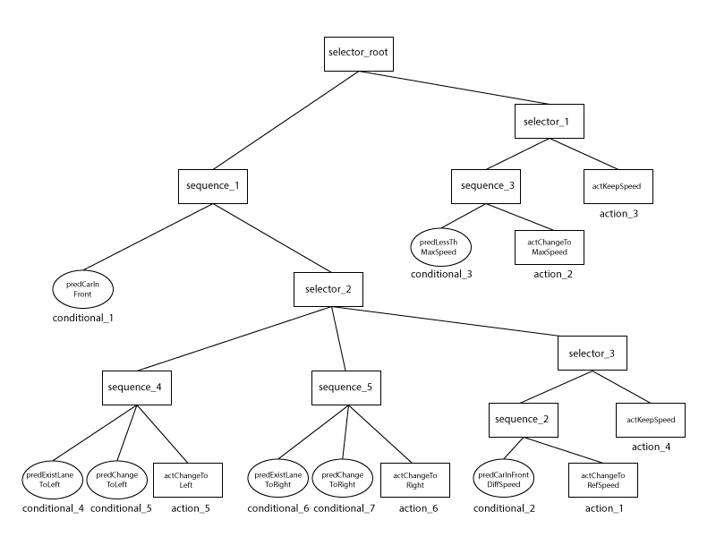

# CarND-Path-Planning-Project
Self-Driving Car Engineer Nanodegree Program

### Simulator. You can download the Term3 Simulator BETA which contains the Path Planning Project from the [releases tab](https://github.com/udacity/self-driving-car-sim/releases).

In this project your goal is to safely navigate around a virtual highway with other traffic that is driving +-10 MPH of the 50 MPH speed limit. You will be provided the car's localization and sensor fusion data, there is also a sparse map list of waypoints around the highway. The car should try to go as close as possible to the 50 MPH speed limit, which means passing slower traffic when possible, note that other cars will try to change lanes too. The car should avoid hitting other cars at all cost as well as driving inside of the marked road lanes at all times, unless going from one lane to another. The car should be able to make one complete loop around the 6946m highway. Since the car is trying to go 50 MPH, it should take a little over 5 minutes to complete 1 loop. Also the car should not experience total acceleration over 10 m/s^2 and jerk that is greater than 50 m/s^3.

#### The map of the highway is in data/highway_map.txt
Each waypoint in the list contains  [x,y,s,dx,dy] values. x and y are the waypoint's map coordinate position, the s value is the distance along the road to get to that waypoint in meters, the dx and dy values define the unit normal vector pointing outward of the highway loop.

The highway's waypoints loop around so the frenet s value, distance along the road, goes from 0 to 6945.554.

## Basic Build Instructions

1. Clone this repo.
2. Make a build directory: `mkdir build && cd build`
3. Compile: `cmake .. && make`
4. Run it: `./path_planning`.

## Docker Build Instructions

1. Start your docker machine (assuming it's called `default`): `docker-machine start default`, if needed.
2. Run the instructions given by: `docker-machine env default`, if needed.
3. Change to your project/repo directory.
4. Build the Dockerfile: `docker build -t ppp .`  (The docker image will be called `ppp`).
5. Run the image: `docker run -p 4567:4567 -it ppp ./path_planning`
6. When finished using the docker machine: `docker-machine stop default`

## Simulator Data

Here is the data provided from the Simulator to the C++ Program

#### Main car's localization Data (No Noise)

["x"] The car's x position in map coordinates

["y"] The car's y position in map coordinates

["s"] The car's s position in frenet coordinates

["d"] The car's d position in frenet coordinates

["yaw"] The car's yaw angle in the map

["speed"] The car's speed in MPH

#### Previous path data given to the Planner

//Note: Return the previous list but with processed points removed, can be a nice tool to show how far along
the path has processed since last time. 

["previous_path_x"] The previous list of x points previously given to the simulator

["previous_path_y"] The previous list of y points previously given to the simulator

#### Previous path's end s and d values 

["end_path_s"] The previous list's last point's frenet s value

["end_path_d"] The previous list's last point's frenet d value

#### Sensor Fusion Data, a list of all other car's attributes on the same side of the road. (No Noise)

["sensor_fusion"] A 2d vector of cars and then that car's [car's unique ID, car's x position in map coordinates, car's y position in map coordinates, car's x velocity in m/s, car's y velocity in m/s, car's s position in frenet coordinates, car's d position in frenet coordinates. 

## Details

1. The car uses a perfect controller and will visit every (x,y) point it recieves in the list every .02 seconds. The units for the (x,y) points are in meters and the spacing of the points determines the speed of the car. The vector going from a point to the next point in the list dictates the angle of the car. Acceleration both in the tangential and normal directions is measured along with the jerk, the rate of change of total Acceleration. The (x,y) point paths that the planner recieves should not have a total acceleration that goes over 10 m/s^2, also the jerk should not go over 50 m/s^3. (NOTE: As this is BETA, these requirements might change. Also currently jerk is over a .02 second interval, it would probably be better to average total acceleration over 1 second and measure jerk from that.

2. There will be some latency between the simulator running and the path planner returning a path, with optimized code usually its not very long maybe just 1-3 time steps. During this delay the simulator will continue using points that it was last given, because of this its a good idea to store the last points you have used so you can have a smooth transition. previous_path_x, and previous_path_y can be helpful for this transition since they show the last points given to the simulator controller with the processed points already removed. You would either return a path that extends this previous path or make sure to create a new path that has a smooth transition with this last path.

## Dependencies

* cmake >= 3.5
 * All OSes: [click here for installation instructions](https://cmake.org/install/)
* make >= 4.1
  * Linux: make is installed by default on most Linux distros
  * Mac: [install Xcode command line tools to get make](https://developer.apple.com/xcode/features/)
  * Windows: [Click here for installation instructions](http://gnuwin32.sourceforge.net/packages/make.htm)
* gcc/g++ >= 5.4
  * Linux: gcc / g++ is installed by default on most Linux distros
  * Mac: same deal as make - [install Xcode command line tools](https://developer.apple.com/xcode/features/)
  * Windows: recommend using [MinGW](http://www.mingw.org/)
* [uWebSockets](https://github.com/uWebSockets/uWebSockets)
  * Run either `install-mac.sh` or `install-ubuntu.sh`.
  * If you install from source, checkout to commit `e94b6e1`, i.e.

``` 
git clone https://github.com/uWebSockets/uWebSockets 
cd uWebSockets
git checkout e94b6e1
```


## Model Documentation

The model I have implemented is based on a Behavior Tree which is used to determine the behavior of the autonomous vehicle. Every time a certain behavior is chosen by the Behavior Tree, a Trajectory is constructed which executes that behavior.

* The Behavior Tree is based on the Master's thesis "Behavior Trees for decision-making in autonomous driving" by Magnus Olsson [PDF](http://www.diva-portal.org/smash/get/diva2:907048/FULLTEXT01.pdf) . A Behavior Tree is an interesting solution for the following reasons:
  * It is easy to extend with new behaviors. Compared with an FSM it is much easier to extend and to maintain the source code.
  * It is also easier to determine which behaviors are executed compared with a system that uses cost-functions to determine the behavior. When multiple cost-functions are present, it can become difficult to tweak the costs to achieve the correct behavior. In addition the occasional unexpected behavior can occur with cost-functions. Not so with Behavior Trees. 
* The Trajectory is constructed using a "Sine Ease In Out" easing function; see [Github (lines 148-152)](https://github.com/warrenm/AHEasing/blob/master/AHEasing/easing.c) . Easing functions are commonly used in computer animation. The chosen easing function seems to work just as fine as a Minimal Jerk Trajectory but is much simpler to implement.

In this implementation the model receives a data update from the simulator 50 times a second. Every time this update is received, the model also updates the path plan with new position(s) and sends it back to the simulator. This plan reaches '50 ticks' into the future, corresponding to 1s (because 50 ticks * 1/50 sec update rate). It is assumed that the other vehicles on the road do not change their speed or lane during this 1s. Usually the plan is not created from scratch, but consists of the plan from previous update minus the position of 1 tick.

A typical update cycle looks like this: The model first receives the data from the simulator. This data consists of positions and speed of the autonomous vehicle, the positions and speed of the other vehicles and the remainder of the previous path plan (i.e. the part which has not yet been executed). The vehicle data is collected and sent to the `Path Planner` object. If, for some reason, the path plan is empty, a new path plan that consists of '50 ticks' will be created. In any case, no matter how many new path plan positions are to be created, a loop takes care of this. 

For every iteration of the loop, first it is determined how many 'ticks' the path plan is ahead of the actual position of the autonomous vehicle. The `Path Planner` object is then tasked with finding the closest vehicles given the 'ticks ahead'. So, if the path plan is 50 ticks ahead then the `Path Planner` object is to find the closest vehicles 1s in the future. This is obviously an estimate. It is based on the assumptions previously mentioned.

The next action in the loop is to run 1 tick in the Behavior Tree. The root node of the tree receives the `selector_root->tick()` instruction and then tells its children to 'tick' as well. See below for a diagram of the Behavior Tree and a short overview of how it works. 

The result, depending on the Action node which is reached, is that 1 of 3 types of behavior are chosen: Change lane, Change speed or Keep speed (and lane). In the case of the changes, the `Path Planner` object tells a `Trajectory` object to create some new `frenet s dot` (set as the distance increment variable) or `frenet d` values. These values are in their turn sent back to the loop where they are used to create a new position to add to the path plan. The loop is now ended.

The new path plan is then sent to the simulator and the update cycle is ended.

## Overview of Source Code

### main.cpp

##### Reading in waypoints (lines 182-231)
Reading the waypoint data from the supplied CSV file. Make sure to add 2 extra waypoints at the end of the track in order to 'close the loop.'

##### Fitting splines to waypoints (lines 235-246)
Creating 4 splines to fit the waypoint data:
1. Spline: f(S) = X
2. Spline: f(S) = Y
3. Spline: f(S) = dX
4. Spline: f(S) = dY

##### Creating the PathPlanner object (lines 250-253)
Initializing the `PathPlanner` object with a `distance increment` of `0.0` because the vehicle is standing still and with a `frenet d` value of `6.0`, given that the vehicle is in the middle lane. The maximum speed is also set to 46 m/s.

##### Building the Behavior Tree (lines 258-334)

The structure of the Behavior Tree can be seen in the diagram above. The source code has been indented in order to reflect the structure.

There are 4 types of nodes in the Behavior Tree (in short):

1. Selector: if one of the child nodes returns 'success' then the selector node is also returns 'success'. Otherwise it returns 'running' if one of its children is running or else it returns 'failure'.
2. Sequence: if all the child nodes are returning 'success' then the sequence will also return 'success'. Otherwise it returns 'running' if one of its children is running or else it returns 'failure'.
3. Conditional: a predicate is tested and the result is 'success' or 'failure'.
4. Action: an action (in this implementation) will either return 'running' or 'success'.

The selector and sequence nodes return to the same child if it returned 'running'. In this manner the Behavior Tree saves the state of the path planning. This is necessary given that some of the Action nodes have a state. When the path planner is in the process changing lanes the Action node which is responsible for this behavior returns 'running'. When it is finished, it returns 'success'.

##### Saving the data of the other vehicles in a vector (lines 396-412)

##### Sending the vehicle data to the PathPlanner object (lines 414-415)

##### Initializing the path plan (lines 427-454)

* Saving the remainder of the path plan, which was returned by the vehicle.
* If the path plan is empty, initialize path planner position based on position of vehicle.
* Otherwise infer path planner position based on the position in the saved path plan.

##### Adding positions to the path plan (lines 461-488)

A for loop is used to make sure that a path is projected 50 ticks out in the future.

For every iteration of the loop:

* Finding the closest vehicles given the ticks ahead.
* The behavior tree is being run using `selector_root->tick()`. 
* The new  `distance increment` value is retrieved from the `PathPlanner` object. A modulo operator is applied to the `distance increment` in order to close the loop.
* Using the splines and the `frenet d` value from the `PathPlanner` in order to calculate the `x` and `y` position.


### pathplanner.cpp

##### Finding the closest vehicles (lines 14-120)

Using the number of ticks ahead, the future estimate of the `frenet s` positions is determined for the autonomous vehicle and later also for the other vehicles on the road. The `frenet s` values are used to determine whether the other vehicles are in front or behind the autonomous vehicle.

In this method vehicles which are closer than 40 meters in front and closer than 15 meters behind are put in vectors per lane. The result is thus 3 vectors with vehicles in front, one for each lane, and 3 vectors with vehicles behind, also one for each lane. These vectors are used in other methods for easy counting and access to relevant vehicle data such as speed.

##### Set the data of the autonomous vehicle (lines 132-145)

Setting the autonomous vehicle speed in the `PathPlanner` object using the `distance increment` times the 50 frames per second rate. Here the lane of the vehicle is also determined.

##### Constructing the predicate "Is there a car in front?" (lines 150-189)

If the vector containing vehicles in front for the same lane as the autonomous vehicle is of non-zero length then this predicate return true.

##### Constructing the predicate "Does the car in front have a lower speed?" (lines 191-252)

##### Constructing the predicate "Is the car at less than maximum speed?" (lines 254-267)

##### Constructing the predicates "Are there lanes to the left or right?" (lines 270-294)

If the autonomous vehicle is in the leftmost lane it cannot change to 'the left lane', because there isn't any. Likewise for the rightmost lane. There is no lane to the right.

##### Constructing the predicates "Can our car move the left or right lane?" (lines 296-375)

Are there any vehicles in the vectors for the left or right lanes? If not, then these predicates return true.

##### Constructing the action "Keep current speed (and lane)" (lines 378-382)

No change in distance increment or lane.

##### Constructing the actions "Changing speed to maximum or reference" (lines 384-429)

The methods `actChangeToMaxSpeed` and `actChangeToRefSpeed` call the `actChangeSpeed` method which is a general method for changing the speed of the vehicle. The latter method takes a start speed and a goal speed. First a Trajectory object is created and then it is initialized with the start and goal speeds. The PathPlanner object is now set to 'running'. As long as it is running, it will tell the Trajectory object to generate a new `frenet s dot` value and retrieve it. The `distance increment` is set to the retrieved value. When the Trajectory object is finished generating `frenet s dot` values, the change speed method will return 'success'.

#####  Constructing the actions "Changing lanes" (lines 431-474)

The methods `actChangeSpeed` and `actChangeToRight` call the `actChangeLane` method which is a method for changing the lane. The process here is analogous to the above methods for changing the speed.

### trajectory.cpp

##### Initializing the `Trajectory` object (lines 3-18)

Here the start and goal values for `frenet S dot` and `frenet d` are set in the object. A variable `p` is also initialized to `0.0`. This variable is used to keep track of progress of the trajectory generation. 

##### Generating trajectory in terms of frenet S dot using an easing function (lines 20-49)

This is the implementation of the "Sine Ease In Out" function for the `frenet s dot` value. It treats two cases. One case where the goal value is higher than the start value and the other case where the goal value is lower than the start value. 

The `p` value is incremented at every tick received by the Action node. This increment is based on the difference between the start and goal value times some constant (in this case 500), which has been found by trial-and-error. The Action node will return 'running' to the Behavior Tree. When `p` is `1.0` the trajectory generation is finished. The Action node will now return 'success'.

##### Generating trajectory in terms of frenet D using an easing function (lines 51-80)

The implementation of the "Sine Ease In Out" function for the `frenet d` value follows the above implementation. The increment of the `p` value has a different constant (30).

### node.cpp

##### Implementing the `tick()` method for the `Conditional` class (lines 4-17)

##### Implementing the `tick()` method for the `Action` class (lines 19-23)

##### Implementing the `tick()` method for the `Sequence` class (lines 25-48)

##### Implementing the `tick()` method for the `Selector` class (lines 50-74)